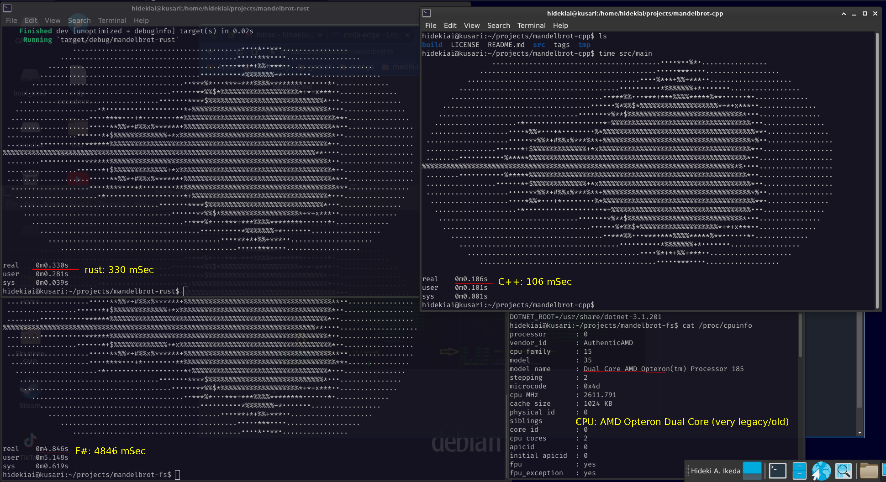

# mandelbrot-cpp

A quick exercise to brush up on C++17 by porting rust-book's mandelbrot

## Configurations

### VSCode configurations

* cppStandard="c++17"
* intelliSenseMode="linux-clang-x64"
* includePath="${workspaceFolder}/**", "/usr/include/**"
* I'll drop .vscode for my Debian config as a sample...

## Sample output

```bash
                 .........................................••••*••%*•................
              ...........................................•••••***••••..................
           ..........................................••••%*+*+%%+***••....................
         .......................................••••••••••*%%%%%%%+*•••••••.................
       .....................................••***%%•••***+***%%%%*****%**••••••*•.............
     ....................................••••••%*%%$*%%%%%%%%%%%%%%%%%%%*+*+x***••..............
    ..................................•••••••*%**$%%%%%%%%%%%%%%%%%%%%%%%%%%%%*•••...............
   ....................•*•••••••••••••••••••*+%%%%%%%%%%%%%%%%%%%%%%%%%%%%%%%%%%•••...............
  ...................••••*%%*•••+*••••••••%*%%%%%%%%%%%%%%%%%%%%%%%%%%%%%%%%%%%%%**•...............
 ....................•••••**%%*+#%%x%***%**+%%%%%%%%%%%%%%%%%%%%%%%%%%%%%%%%%%%%*%••................
 .................••••••*+$%%%%%%%%%%%%%+*x%%%%%%%%%%%%%%%%%%%%%%%%%%%%%%%%%%%%%*••.................
 ........•••••••••••%*****%%%%%%%%%%%%%%%%%%%%%%%%%%%%%%%%%%%%%%%%%%%%%%%%%%%%%*••..................
%%%%%%%%%%%%%%%%%%%%%%%%%%%%%%%%%%%%%%%%%%%%%%%%%%%%%%%%%%%%%%%%%%%%%%%%%%%%*%••••..................
 ........•••••••••••%*****%%%%%%%%%%%%%%%%%%%%%%%%%%%%%%%%%%%%%%%%%%%%%%%%%%%%%*••..................
 .................••••••*+$%%%%%%%%%%%%%+*x%%%%%%%%%%%%%%%%%%%%%%%%%%%%%%%%%%%%%*••.................
 ....................•••••**%%*+#%%x%***%**+%%%%%%%%%%%%%%%%%%%%%%%%%%%%%%%%%%%%*%••................
  ...................••••*%%*•••+*••••••••%*%%%%%%%%%%%%%%%%%%%%%%%%%%%%%%%%%%%%%**•...............
   ....................•*•••••••••••••••••••*+%%%%%%%%%%%%%%%%%%%%%%%%%%%%%%%%%%•••...............
    ..................................•••••••*%**$%%%%%%%%%%%%%%%%%%%%%%%%%%%%*•••...............
     ....................................••••••%*%%$*%%%%%%%%%%%%%%%%%%%*+*+x***••..............
       .....................................••***%%•••***+***%%%%*****%**••••••*•.............
         .......................................••••••••••*%%%%%%%+*•••••••.................
           ..........................................••••%*+*+%%+***••....................
              ...........................................•••••***••••..................

real 0m0.106s
user 0m0.101s
sys 0m0.001s

```


